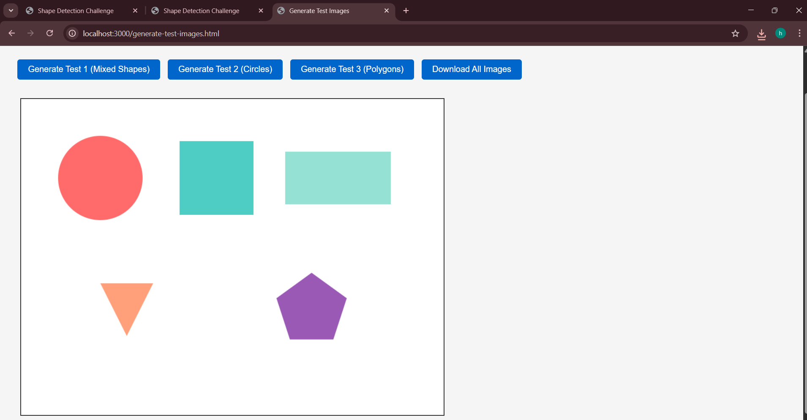
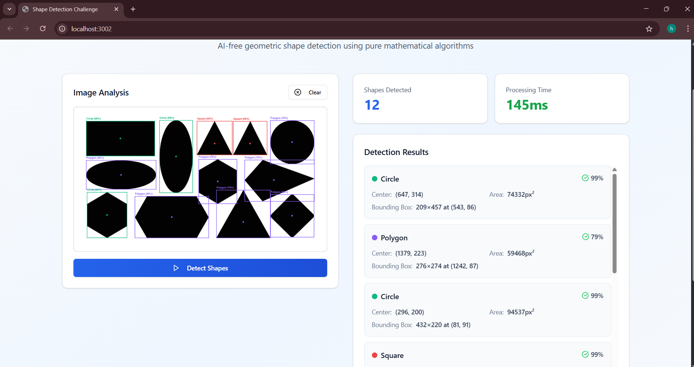
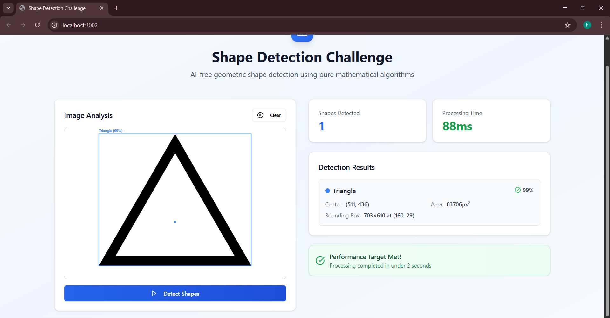

# Shape Detection Challenge

## Overview

This project is a browser-based geometric shape detection system that identifies and classifies shapes using pure mathematical algorithms.  
It demonstrates how geometric logic and the HTML Canvas API can be used for image analysis without any AI or machine learning models.

---

## Features

- Detects circles, triangles, rectangles, squares, and polygons  
- Built entirely with React and native JavaScript  
- Provides bounding boxes, center points, areas, and confidence scores  
- Uses mathematical image analysis only, no external ML libraries  
- Fast detection with average processing time under two seconds  
- Responsive interface with drag-and-drop image upload  

---

## How It Works

1. Converts the uploaded image to grayscale  
2. Applies binary thresholding to separate objects from the background  
3. Detects edges and traces contours using connected component analysis  
4. Simplifies boundaries with the Douglas–Peucker algorithm  
5. Classifies shapes based on geometric properties such as:
   - Circularity and equal width/height for circles  
   - Three vertices for triangles  
   - Four vertices with unequal sides for rectangles  
   - Four vertices with equal sides for squares  
   - Five or more vertices for polygons  

---

## Technology Stack

- React 19  
- Tailwind CSS  
- CRACO build configuration  
- Lucide React for icons  
- HTML Canvas API for pixel-level analysis  
- Pure JavaScript for all shape detection logic  

---

## Getting Started

### Installation

```bash
cd frontend
npm install --legacy-peer-deps

## Screenshots

### 1. Home Page


### 2. Test Images


### 3. Detection Results - Example 1


### 4. Detection Results - Example 2

